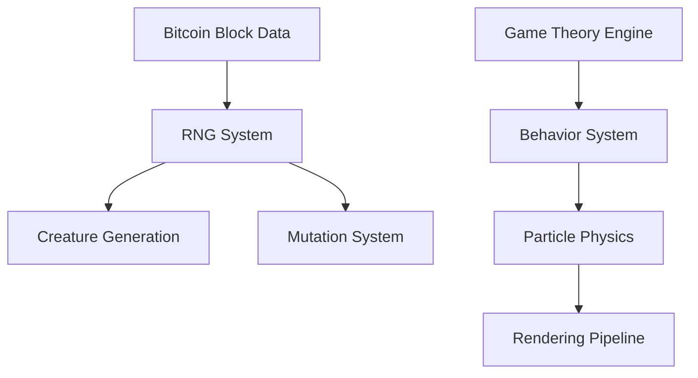
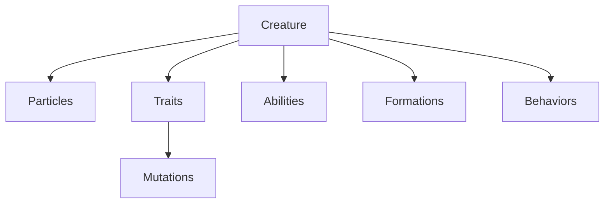

# GROK NAVIGATION INDEX

> Bitcoin Protozoa: A particle-based life simulation system powered by Bitcoin block data

## 🚀 Start Here
1. [Project Rules](./docs/rules.md) - Essential implementation rules and constraints
2. [Project Overview](./docs/project_overview.md) - System architecture and concepts

## 🏗️ Architectural Overview

### Core Systems Architecture


### Domain Model


## 🔄 System Lifecycles

### Creature Lifecycle
1. Bitcoin block data fetched
2. RNG seed generated from block nonce
3. Initial particle distribution created
4. Traits assigned based on block data
5. Abilities computed from traits
6. Formation patterns established
7. Behaviors initialized
8. Rendering pipeline activated

### Evolution Lifecycle
1. Block confirmation triggers evolution
2. Mutation candidates identified
3. Game theory calculations performed
4. Successful traits reinforced
5. Particle system updated
6. Visual representation adapted

## 🎯 Core Design Principles

### 1. Deterministic Generation
- All randomness derives from Bitcoin block data
- Consistent creature generation across instances
- Reproducible evolution paths

### 2. Performance Optimization
```typescript
// Example: Particle System Optimization
interface ParticleGroup {
    role: Role;
    count: number;
    instancedMesh: THREE.InstancedMesh;
    bufferGeometry: THREE.BufferGeometry;
}
```

### 3. Worker Distribution
```typescript
// Example: Compute Distribution
interface ComputeTask {
    priority: number;
    workerId: string;
    particleGroup: ParticleGroup;
    behaviorCalculation: BehaviorCalculation;
}
```

## 📊 System Integration Points

### Bitcoin Integration
```typescript
interface BlockData {
    height: number;       // Block height
    hash: string;        // Block hash
    nonce: string;       // Used for RNG seed
    timestamp: number;   // Affects mutation rates
    confirmations: number; // Triggers evolution
    difficulty: number;  // Influences trait rarity
}
```

### Particle System Integration
```typescript
interface ParticleSystem {
    roles: Map<Role, ParticleGroup>;
    behaviors: BehaviorSet;
    formations: FormationPattern[];
    mutations: MutationQueue;
}
```

## 🔍 Key Implementation Patterns

### 1. Service Pattern
```typescript
// Example: Service Implementation
class TraitService {
    private static instance: TraitService;
    private constructor() {}

    public static getInstance(): TraitService {
        if (!TraitService.instance) {
            TraitService.instance = new TraitService();
        }
        return TraitService.instance;
    }
}
```

### 2. Observer Pattern
```typescript
// Example: Event System
interface EventEmitter {
    on(event: EventType, callback: (data: any) => void): void;
    emit(event: EventType, data: any): void;
}
```

### 3. Factory Pattern
```typescript
// Example: Creature Factory
interface CreatureFactory {
    createFromBlock(blockData: BlockData): Creature;
    evolveCreature(creature: Creature): Creature;
}
```

## 🔧 Technical Stack Integration

### Three.js Integration
- Instanced mesh rendering
- Custom shader implementation
- Particle system optimization
- Level of detail management

### Web Worker Integration
- Physics calculations
- Behavior computations
- Bitcoin data fetching
- Formation pattern processing

## 📈 Performance Considerations

### Rendering Pipeline
1. Instanced rendering for particles
2. Shader-based visual effects
3. LOD system for distance optimization
4. Batch updates for transforms

### Compute Pipeline
1. Worker-based physics calculations
2. Chunked behavior processing
3. Spatial partitioning for collision
4. Throttled updates for non-critical systems

## 🎮 Game Theory Implementation

### Decision Making
```typescript
interface DecisionMatrix {
    payoffMatrix: number[][];
    strategySpace: Strategy[];
    equilibriumPoints: EquilibriumPoint[];
}
```

### Battle System
```typescript
interface BattleSystem {
    calculateOutcome(a: Creature, b: Creature): BattleResult;
    applyConsequences(result: BattleResult): void;
}
```

## 🛠️ Recent TypeScript Improvements

### Type System Enhancements
- Standardized Vector3 interface from common.ts
- Created ColorTheme interface for consistent color handling
- Updated Tier and Role enums with consistent naming conventions
- Fixed RNG system to use complete block data instead of just nonce
- Added proper type definitions for animations and abilities

### Code Quality Improvements
- Fixed duplicate function issues in worker files
- Added proper type annotations to trait files
- Improved error handling in Bitcoin service
- Enhanced type safety in particle system

## 🔍 Search Tags
#ARCHITECTURE #PARTICLE_SYSTEM #BITCOIN_INTEGRATION
#GAME_THEORY #EVOLUTION #PERFORMANCE_OPTIMIZATION
#THREE_JS #WEB_WORKERS #TYPESCRIPT

## 📚 Essential Documentation

## 📚 Essential Architecture Documents
Read these documents in the following order for complete project understanding:

1. **Project Overview**
   [@docs/project_overview.md](./docs/project_overview.md)
   - Core concept and key features
   - Technical architecture overview
   - Development approach

2. **Project Structure**
   [@docs/directory_structure.md](./docs/directory_structure.md)
   - Complete directory layout
   - Component organization
   - File hierarchy

3. **Dependency Map**
   [@docs/dependency_map.md](./docs/dependency_map.md)
   - Import/export relationships
   - Service dependencies
   - Library hierarchy
   - Worker dependencies

4. **Implementation Checklist**
   [@docs/project_checklist.md](./docs/project_checklist.md)
   - Implementation status
   - Core systems progress
   - Testing status
   - Documentation status

5. **Naming Conventions**
   [@docs/naming_conventions.md](./docs/naming_conventions.md)
   - File and directory naming
   - Import/export naming
   - Documentation naming

## Project Root Structure
```
protozoa/
├── src/               # Source code
│   ├── types/         # Type definitions
│   │   ├── core.ts       # Core type definitions
│   │   ├── common.ts     # Common interfaces
│   │   ├── trait.ts      # Trait interfaces
│   │   ├── rng.ts        # RNG system types
│   │   ├── animation.ts  # Animation types
│   │   └── visual.ts     # Visual effect types
│   ├── services/      # Business logic
│   │   ├── bitcoin/     # Bitcoin integration
│   │   ├── traits/      # Trait management
│   │   ├── visuals/     # Visual effects
│   │   └── rendering/   # Rendering pipeline
│   ├── lib/           # Core utilities
│   │   ├── rngSystem.ts # RNG implementation
│   │   ├── formationSystem.ts # Formation logic
│   │   └── particleSystem.ts # Particle management
│   ├── data/          # Data definitions
│   │   └── traits/      # Trait data
│   ├── components/    # React components
│   └── workers/       # Web workers
│       ├── physics/     # Physics calculations
│       ├── behavior/    # Behavior processing
│       └── render/      # Rendering workers
├── docs/              # Documentation
└── tests/             # Test suite
```

[Previous content remains the same...]

